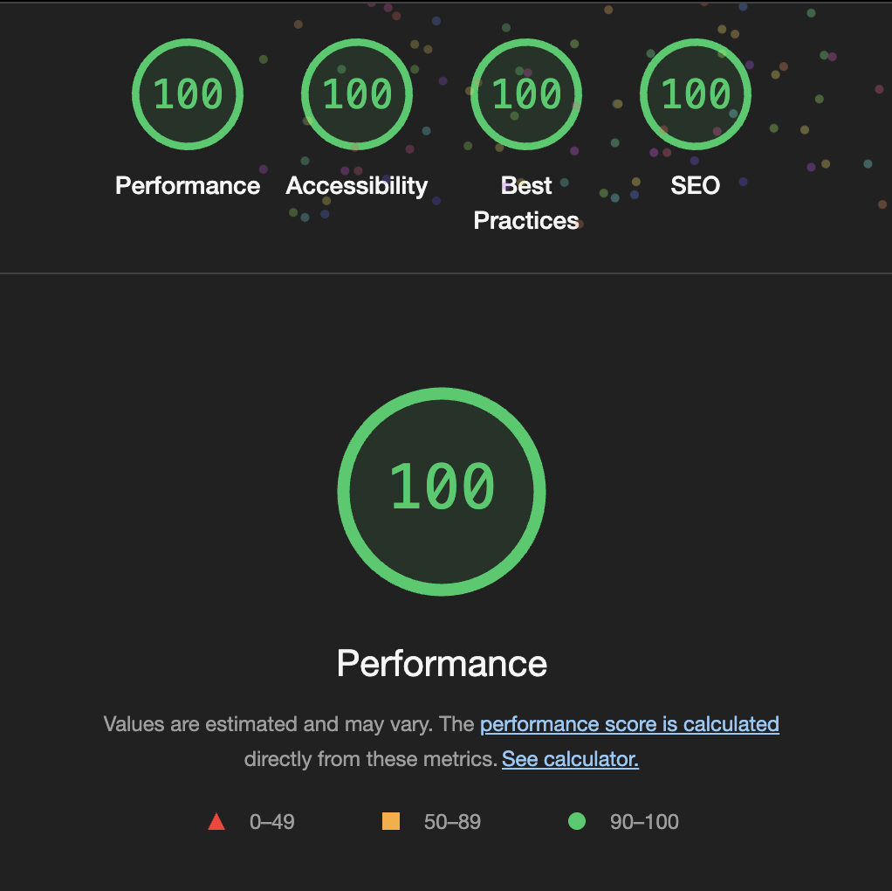

# 🚀 GetShipKit

A modern, production-ready SaaS starter template built with Next.js, TypeScript, Tailwind CSS, DaisyUI, Clerk, Supabase, and Polar.sh.


## 📑 Table of Contents

- [Features](#✨-features)
- [Live Demo](#🌐-live-demo)
- [Quick Start](#🏃‍♂️-quick-start)
- [Prerequisites](#📋-prerequisites)
- [Setup](#🛠️-simple-setup-steps)
- [Deployment](#🚢-deployment-options)
- [Troubleshooting](#🔧-troubleshooting)
- [Learning Resources](#📚-learning-resources)
- [Roadmap](#🛣️-roadmap)
- [Contributing](#🤝-contributing)
- [License](#📝-license)
- [Support](#💬-support)

## ✨ Features

- **Next.js 15 App Router**: Server components, routing, and API routes in one place
- **TypeScript**: Full type safety across the entire codebase
- **Tailwind CSS & DaisyUI**: Beautifully designed components with minimal effort
- **Clerk Authentication**: Secure user management with social logins, MFA, and more
- **Supabase Database**: Powerful PostgreSQL database with real-time capabilities
- **Polar.sh Payments**: Subscription management and payment processing
- **PWA Ready**: Offline support with web-manifest & install prompt
- **SEO Optimized**: Automatic sitemap & robots.txt generation out of the box



## 🌐 Live Demo

> Coming soon – a publicly hosted demo will be available at **https://demo.getshipkit.com**

## 🔥 Everything Pre-configured!

This template comes with **all integrations already set up and working**. You just need to:

1. Add your API credentials
2. Copy-paste the provided SQL schema
3. Start building your SaaS product features

## 🏃‍♂️ Quick Start

```bash
# Clone the repo
git clone https://github.com/yourusername/getshipkit.git my-getshipkit-app

# Navigate to the project
cd my-getshipkit-app

# Install dependencies
npm install

# Create env file and add your API keys
cp .env.example .env.local

# Start the development server
npm run dev
```

Then visit [http://localhost:3000](http://localhost:3000) to see your app.

## 📋 Prerequisites

Before you begin, ensure you have:

- **Node.js 18+** and npm (or yarn/pnpm)
- **Git** for version control
- Accounts with these services (all have free tiers):
  - [Clerk](https://clerk.dev) for authentication
  - [Supabase](https://supabase.com) for database
  - [Polar.sh](https://polar.sh) for payments

## 🛠️ Simple Setup Steps

### 1. Clone and Rename

```bash
# Clone the repo with your project name
git clone https://github.com/yourusername/getshipkit.git my-getshipkit-project

# Navigate to your project
cd my-getshipkit-project

# Optional: Remove git history and start fresh
rm -rf .git
git init
```

### 2. Install Dependencies

```bash
npm install
```

### 3. Add Your API Credentials

<details>
<summary><b>Clerk Authentication Setup</b></summary>

1. Create a new application in [Clerk Dashboard](https://dashboard.clerk.dev)
2. Copy your API keys from the dashboard
3. Paste them into your `.env.local` file:
   ```
   NEXT_PUBLIC_CLERK_PUBLISHABLE_KEY=your_clerk_publishable_key
   CLERK_SECRET_KEY=your_clerk_secret_key
   ```

**Note**: All Clerk integration code is already implemented in the project.
</details>

<details>
<summary><b>Supabase Database Setup (Super Simple)</b></summary>

1. Create a new project in [Supabase Dashboard](https://app.supabase.io)
2. Copy your project URL and anon key from Project Settings > API
3. Paste them into your `.env.local` file:
   ```
   NEXT_PUBLIC_SUPABASE_URL=your_supabase_project_url
   NEXT_PUBLIC_SUPABASE_ANON_KEY=your_supabase_anon_key
   SUPABASE_SERVICE_ROLE_KEY=your_supabase_service_role_key
   ```
4. Set up your database schema by simply copying the contents of `schema_export.sql` and pasting it into the SQL Editor in your Supabase dashboard

**Note**: All Supabase integration code is already implemented in the project.
</details>

<details>
<summary><b>Connecting Clerk with Supabase</b></summary>

This important step ensures your Clerk authentication seamlessly integrates with your Supabase database:

1. Visit [Clerk's Supabase Setup Page](https://dashboard.clerk.com/setup/supabase)
2. Select your Clerk application
3. Copy the  URL provided by Clerk

In your Supabase dashboard:
1. Go to Project Settings → Authentication → Third Party Authentication
2. Click "Add Provider" and select "Clerk"
3. Paste the connection URL you copied from Clerk
4. Save the configuration

Now your Clerk users will automatically sync with Supabase, allowing you to use row-level security with the authenticated user's ID.

**Note**: This integration allows you to use Supabase's powerful row-level security while leveraging Clerk's superior authentication experience.
</details>

<details>
<summary><b>Polar.sh Payments Setup</b></summary>

1. Create an account on [Polar.sh](https://polar.sh)
2. Generate your access token and webhook secret from the dashboard
3. Paste them into your `.env.local` file:
   ```
   POLAR_ACCESS_TOKEN=your_polar_access_token
   POLAR_WEBHOOK_SECRET=your_webhook_secret_from_polar
   ```

**Note**: All Polar.sh integration code is already implemented in the project.

**Setting up the Customer Portal:**

The Polar Customer Portal allows users to manage their subscriptions. This boilerplate includes a "Manage Subscription" button on the billing page that redirects users to the Polar Customer Portal.

1. The portal is configured at `/app/portal/route.ts` using the `CustomerPortal` from `@polar-sh/nextjs`.
2. Make sure your `POLAR_ACCESS_TOKEN` is set in your `.env.local` file.
3. The portal uses the user's email as the customer ID by default. Modify the `getCustomerId` function if you need a different identifier.

**Setting up Webhooks for Local Development:**

During development, you need a public URL to receive webhook events from Polar. Here's how to set it up:

1. Install [ngrok](https://ngrok.com/download) if you haven't already
2. Start your Next.js application:
   ```bash
   npm run dev
   ```
3. In a new terminal window, create a tunnel to your local server:
   ```bash
   ngrok http 3000
   ```
4. Copy the HTTPS URL provided by ngrok (e.g., `https://a1b2-103-199-202-181.ngrok-free.app`)
5. In the Polar dashboard, set your webhook URL by appending the API path:
   ```
   https://your-ngrok-url.ngrok-free.app/api/webhook/polar
   ```
6. Polar will generate a WEBHOOK_SECRET for you
7. Update your `.env.local` file with this new secret:
   ```
   POLAR_WEBHOOK_SECRET=your_new_webhook_secret
   ```

Now Polar can send real-time payment events to your local development environment!
</details>

### 4. Environment Configuration

Create a `.env.local` file in the root directory:

```bash
# Copy the example env file
cp .env.example .env.local
```

Then add your API keys to the file. Here's a complete template:

```
# Authentication - Clerk
NEXT_PUBLIC_CLERK_PUBLISHABLE_KEY=your_clerk_publishable_key
CLERK_SECRET_KEY=your_clerk_secret_key
NEXT_PUBLIC_CLERK_SIGN_IN_URL=/sign-in
NEXT_PUBLIC_CLERK_SIGN_UP_URL=/sign-up
NEXT_PUBLIC_CLERK_AFTER_SIGN_IN_URL=/dashboard
NEXT_PUBLIC_CLERK_AFTER_SIGN_UP_URL=/dashboard


# Supabase
NEXT_PUBLIC_SUPABASE_URL=your_supabase_project_url
NEXT_PUBLIC_SUPABASE_ANON_KEY=your_supabase_anon_key
SUPABASE_SERVICE_ROLE_KEY=your_supabase_service_role_key


# Set to either "sandbox" or "production"

POLAR_MODE=sandbox


# Polar Payments
POLAR_ACCESS_TOKEN=your_polar_access_token
POLAR_WEBHOOK_SECRET=your_webhook_secret_from_polar
POLAR_SUCCESS_URL=http://localhost:3000/dashboard/billing?success=true


# Polar Product IDs
POLAR_PRO_MONTHLY_ID=your_pro_monthly_plan_id
POLAR_PRO_ANNUAL_ID=your_pro_annual_plan_id
POLAR_ENTERPRISE_MONTHLY_ID=your_enterprise_monthly_plan_id
POLAR_ENTERPRISE_ANNUAL_ID=your_enterprise_annual_plan_id

# Payment Model Configuration (options: 'subscription' or 'onetime')
NEXT_PUBLIC_PAYMENT_MODEL=subscription

# Product IDs with display names (JSON ID:NAME format)
NEXT_PUBLIC_PRODUCTS={"starter_monthly":"b62c857d-4bd6-41ac-9721-5b26f592c19c:Basic","starter_annual":"96503da7-e3db-43d4-96e5-afbae18dc83f:Basic","pro_monthly":"20b937bc-fcba-4076-886b-621be00277e8:Premium","pro_annual":"0af3136d-4653-455b-a206-7b99f4ea7712:Premium","enterprise_monthly":"4b25a4af-fd24-459d-a8b3-385f2889116b:Ultimate","enterprise_annual":"f74696b1-55a1-498c-b776-d62e2ba17cd5:Ultimate","one_time":"e7a07f01-3323-44c5-8965-0bcd2ddea7af:Forever Access"}
```

> **Important**: Replace the placeholder values with your own API keys from your service dashboards.

### 5. Launch Development Server

```bash
npm run dev
```

Your SaaS application will be running at [http://localhost:3000](http://localhost:3000)

## 📁 Project Structure

```
├── src/
│   ├── app/               # App router pages and API routes
│   │   ├── api/           # Backend API endpoints
│   │   │   ├── webhooks/  # Service webhook handlers
│   │   │   └── ...        # Other API routes
│   │   ├── auth/          # Authentication pages
│   │   ├── dashboard/     # Dashboard pages
│   │   └── ...            # Other routes
│   ├── components/        # Reusable UI components
│   │   ├── ui/            # Base UI components
│   │   ├── dashboard/     # Dashboard-specific components
│   │   └── ...            # Other components
│   ├── lib/               # Utilities and configurations
│   │   ├── supabase.ts    
# Supabase client
│   │   ├── clerk.ts       # Clerk utilities
│   │   └── polar.ts       # Polar.sh integration
│   └── middleware.ts      # Auth middleware
├── public/                # Static files
├── supabase/              # Database migrations and schema
├── scripts/               # Utility scripts
├── schema_export.sql      # Ready-to-use database schema
├── package.json           # Dependencies and scripts
├── tailwind.config.js     # Tailwind CSS configuration
└── next.config.js         # Next.js configuration
```

## 🎨 Customization Guide

### Branding and Theme

This project uses DaisyUI and Tailwind CSS for a beautiful design system:

1. Update `tailwind.config.js` with your brand colors:

```js
// Customize your brand colors
theme: {
  extend: {
    colors: {
      // Primary brand color with shades
      primary: {
        50: '#f0f9ff',
        100: '#e0f2fe',
        200: '#bae6fd',
        300: '#7dd3fc',
        400: '#38bdf8',
        500: '#0ea5e9', // Base color
        600: '#0284c7',
        700: '#0369a1',
        800: '#075985',
        900: '#0c4a6e',
      },
      // Secondary/accent color
      secondary: {
        50: '#f5f3ff',
        // ...other shades
        500: '#8b5cf6', // Base color
        // ...other shades
      },
      // Neutral colors
      neutral: {
        50: '#fafafa',
        // ...other shades
        900: '#171717',
      },
    }
  }
}
```

2. Follow the 60-30-10 color rule for a balanced design:
   - **60%**: Primary neutral colors (backgrounds, containers)
   - **30%**: Secondary colors (sections, cards, secondary UI)
   - **10%**: Accent colors (buttons, links, highlights)

3. Design tips:
   - Use consistent spacing (0.5rem, 1rem, 1.5rem, etc.)
   - Prioritize visual hierarchy with size and weight contrasts
   - Use interactive elements instead of static text where appropriate

### Content Customization

1. Update company information in:
   - `src/app/layout.tsx` (metadata)
   - `src/components/footer.tsx` (links and copyright)
   - `public/` (favicon, logos, and images)

2. Modify pricing plans in:
   - `src/app/pricing/page.tsx`
   - Sync with your Polar.sh subscription tiers

## 🚢 Deployment Options

### Vercel (Recommended)

The fastest way to deploy:

[](https://vercel.com/new/clone?repository-url=https%3A%2F%2Fgithub.com%2Fyourusername%2Fgetshipkit)

1. Connect your GitHub repository
2. Add all environment variables
3. Deploy!

### Other Hosting Options

<details>
<summary><b>Railway</b></summary>

1. Connect your GitHub repository to [Railway](https://railway.app)
2. Set environment variables
3. Deploy with:
   ```bash
   npm run build && npm start
   ```
</details>

<details>
<summary><b>Docker</b></summary>

1. Build your Docker image:
   ```bash
   docker build -t my-getshipkit-app .
   ```

2. Run your container:
   ```bash
   docker run -p 3000:3000 --env-file .env.production my-getshipkit-app
   ```
</details>

## 🔧 Troubleshooting

### Common Issues and Solutions

<details>
<summary><b>Authentication Problems</b></summary>

* **Issue**: Users can't log in
  * Verify Clerk API keys are correct in your .env file
  * Check that redirect URLs match exactly in both Clerk dashboard and your code
  * Look for CORS issues in browser console

* **Issue**: Social logins not working
  * Ensure social providers are properly configured in Clerk dashboard
  * Check callback URLs are correctly set
</details>

<details>
<summary><b>Database Connection Issues</b></summary>

* **Issue**: "Error connecting to database"
  * Verify Supabase URL and keys are correct
  * Check if your IP is allowed in Supabase dashboard
  * Make sure your database schema matches the expected structure

* **Issue**: Missing tables or columns
  * Ensure you've pasted the full contents of `schema_export.sql` into Supabase SQL Editor
  * Run the SQL commands in the Supabase dashboard
</details>

<details>
<summary><b>Payment Processing Errors</b></summary>

* **Issue**: Payments not processing
  * Verify Polar.sh credentials
  * Check webhook endpoints are correctly configured
  * Test with Polar.sh's sandbox mode first

* **Issue**: Webhooks not being received
  * Use a tool like ngrok to expose local endpoints for testing
  * Check webhook secret is correctly set
</details>

## 📚 Learning Resources

- [Next.js Documentation](https://nextjs.org/docs)
- [Tailwind CSS Documentation](https://tailwindcss.com/docs)
- [DaisyUI Documentation](https://daisyui.com/docs)
- [Clerk Documentation](https://clerk.dev/docs)
- [Supabase Documentation](https://supabase.com/docs)
- [Polar.sh Documentation](https://polar.sh/docs)


## 🤝 Contributing

Contributions are welcome! Please feel free to submit a Pull Request.

1. Fork the repository
2. Create your feature branch: `git checkout -b feature/amazing-feature`
3. Commit your changes: `git commit -m 'Add some amazing feature'`
4. Push to the branch: `git push origin feature/amazing-feature`
5. Open a Pull Request

## 📝 License

This project is licensed under the **MIT License** - see the [LICENSE.md](LICENSE.md) file for details. You are free to use, modify, distribute, and sell this software with minimal restrictions.

